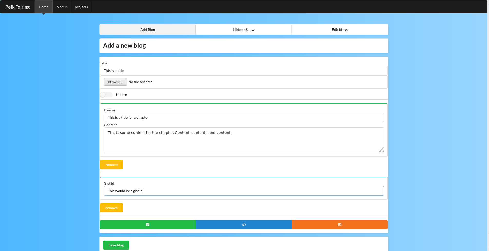

Frontend repository for my personal site

Site has the functionality to create blog posts and three main views intended for public.

Routing is done with React router and blog-data is held in Redux store. 

live at peikfeiring.com

